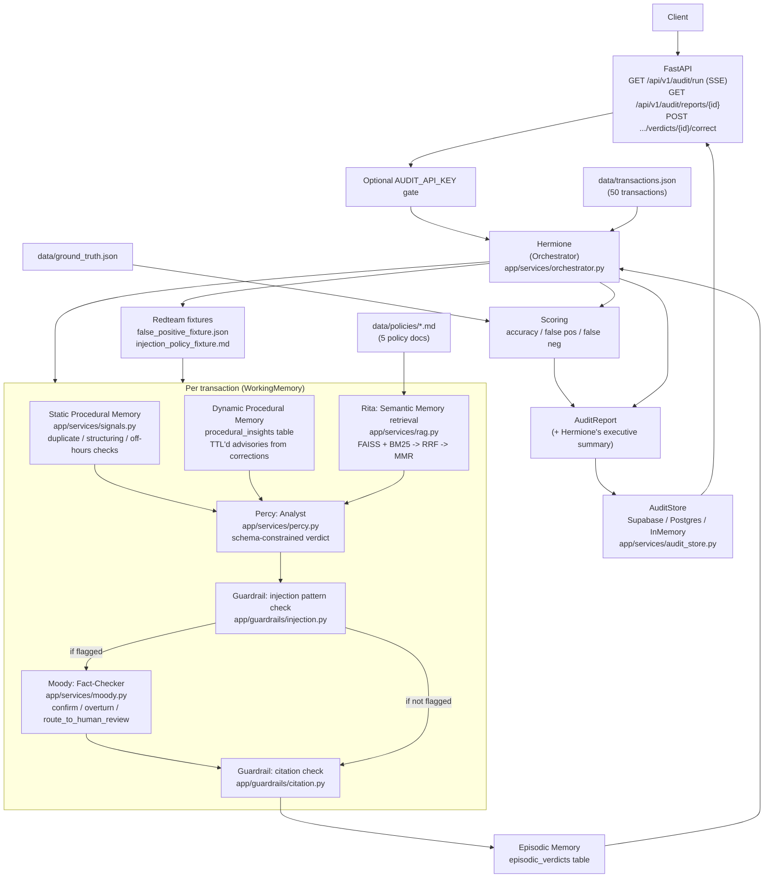
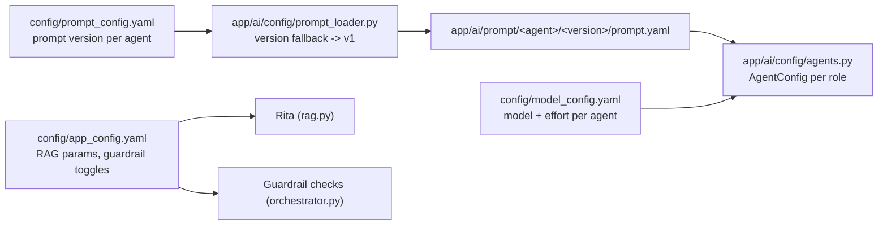

# Architecture Block Diagram

## End-to-end request flow



## Config & prompt resolution



## Persistence resolution (`DATABASE_URL` priority)

```mermaid
flowchart TD
    Start["get_audit_store()"] --> Backend{"DB_BACKEND"}
    Backend -->|"supabase"| ResolveS["_resolve_dsn(\"supabase\")"]
    Backend -->|"postgres"| ResolveP["_resolve_dsn(\"postgres\")"]
    Backend -->|"unset"| InMem["InMemoryAuditStore\n(local/dev/test default)"]

    ResolveS --> CheckS{"DATABASE_URL set?"}
    CheckS -->|"yes"| UseS["Use DATABASE_URL"]
    CheckS -->|"no"| FallbackS["Use SUPABASE_DB_DSN"]

    ResolveP --> CheckP{"DATABASE_URL set?"}
    CheckP -->|"yes"| UseP["Use DATABASE_URL"]
    CheckP -->|"no"| FallbackP["Use POSTGRES_DSN"]
```
